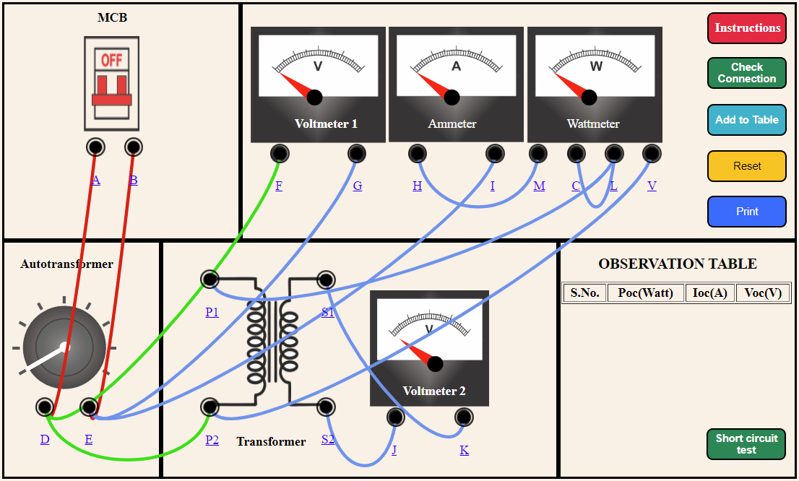
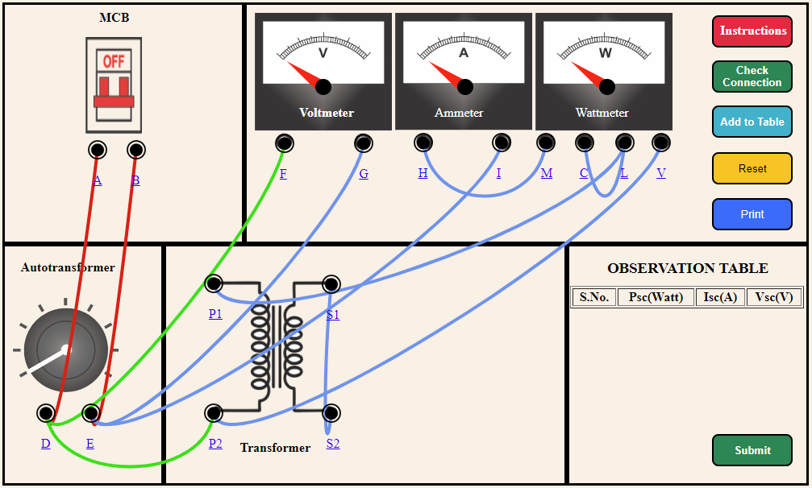

1. Make the proper connection by clicking the node as instructed below. If the wire is misplaced, click the node number to deattach the nodes wire.  
 
2. Then click check button to check connection is correct or not. 
3. Then click autotransformer to get the change in all meter. 
4. Then click add to table botton to get the reading of over open circuit transformer. 
5. Then we have done open circuit transformer test. Then click short button for short circuit transformer test. 
6. Make the proper connection by clicking the node as instructed below. If the wire is misplaced, click the node number to deattach  the nodes wire. 
  
7. Then click check button to check connection is correct or not. 
8. Then click add to table botton to get the reading of over short circuit transformer. 
9. Then we have done short circuit transformer test. Then click submit button for get result. 
10. Then we have the result in diagram form. We also print the result by click on print button.

