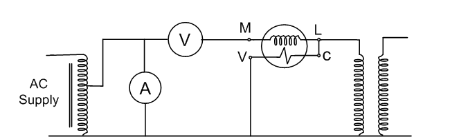
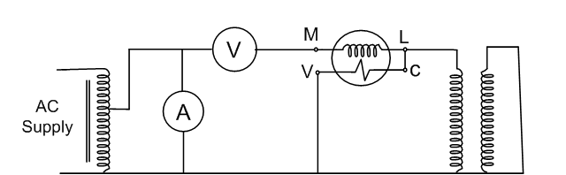

### Introduction 
The open circuit and short circuit tests are performed for determining the parameter of the transformer like their efficiency, voltage regulation, circuit constant, etc. These tests are performed without the actual loading and because of this reason the very less power is required for the test. The open circuit and the short circuit test gives a very accurate result as compared to the full load test. 

### Open Circuit Test
The purpose of the open-circuit test is to determine the no-load current and losses of the transformer because of which their no-load parameter is determined. This test is performed on the primary winding of the transformer. The wattmeter, ammeter, and the voltage are connected to their primary winding. The nominal rated voltage is supplied to their primary winding with the help of the ac source. 
The secondary winding of the transformer is kept open and the voltmeter is connected to their terminal. This voltmeter measures the secondary induced voltage. As the secondary of the transformer is open the no-load current flows through the primary winding.
The value of no-load current is very small as compared to the full rated current. The copper loss occurs only on the primary winding of the transformer because the secondary winding is open. The reading of the wattmeter only represents the core and iron losses. The core loss of the transformer is same for all types of loads. 

 

<b>Figure : Equivalant circuit diagram for open circuit test on transformer</b>
 

### Calculation of open circuit test :
Let, 

W0 – wattmeter reading 
V1 – voltmeter reading 
I0 – ammeter reading 
Then the iron loss of the transformer Pi = W0 and 

W0 =(V1)(I0)CosФ ..............................eq (1)  
The no-load power factor is 

<b>CosФ = W0/V1I0</b>
 
Working component Iw is 
Iw = W0/V1 .............................  eq (2) 
Putting the value of W0 from the equation (1) in equation (2) you will get the value of working component as 

<b>Iw = I0CosФ</b>
 

Magnetizing component is 

<b>Im = [I0^2 - Iw^2]^(1/2)</b>
 

No load parameters are given below : 

Equivalent exciting resistance is 

<b>R0 = V1/Iw</b>
 

Equivalent exciting reactance is 

<b>X0 = V1/Im</b>

 

### Short Circuit Test :

The short circuit test is performed for determining the below mention parameter of the transformer. 

1. It determines the copper loss occurs on the full load. The copper loss is used for finding the efficiency of the transformer. 
2. The equivalent resistance, impedance, and leakage reactance are known by the short circuit test. 

The short circuit test is performed on the secondary or high voltage winding of the transformer. The measuring instrument like wattmeter, voltmeter, and ammeter are connected to the high voltage winding of the transformer. Their primary winding is shortcircuited by the help of thick strip or ammeter which is connected to their terminal.
The low voltage source is connected across the secondary winding because of which the full load current flows from both the secondary and the primary winding of the transformer. The full load current is measured by the ammeter connected across their secondary winding. 
The low voltage source is applied across the secondary winding which is approximately 5 to 10% of the normal rated voltage. The flux is set up in the core of the transformer. The magnitude of the flux is small as compared to the normal flux.
The iron loss of the transformer depends on the flux. It is less occur in the short circuit test because of the low value of flux. The reading of the wattmeter only determines the copper loss occur on their windings. The voltmeter measures the voltage applied to their high voltage winding. The secondary current induces in the transformer because of the applied voltage. 

 

<b>Figure : Equivalant circuit diagram for short circuit test on transformer</b>
 

 
### Calculation of short circuit test:

Let, 

Wc – wattmeter reading 
Vsc – voltmeter reading 
Isc – ammeter reading 
Then the full load copper loss of the transformer is given by 

<b>Pc = [Ifl/Isc]^2.Wc  
Isc^2 Rs = Wc </b>
  

Equivalent resistance referred to secondary side is 

<b>Rs = Wc/(Isc^2) </b>
 

Equivalent impedance referred to the secondary side is given by 

<b>Zs = Vsc/Isc</b>
 
The Equivalent reactance referred to the secondary side is given by 

<b>Xs = [(Zs)^2 - (Rs)^2]^1/2 </b>
 

